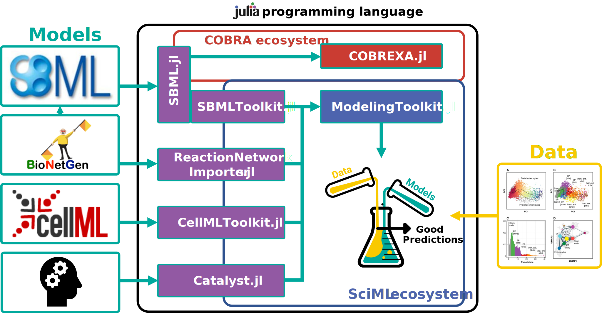

# Summary

SBMLToolkit.jl is a lightweight tool to import models specified in the Systems Biology
Markup Language (SBML) [@hucka_systems_2003] into the Julia SciML ecosystem. SBMLToolkit uses the
SBML.jl [@sbmljl] wrapper of the libSBML library [@Bornstein2008libsbml] to lower dynamical SBML
models into dynamical systems.

# Statement of need

Julia is a general purpose programming language that was designed for simplifying
and accelerating numerical analysis and computational science. Building on the
computer algebra system Symbolics.jl [@10.1145/3511528.3511535], many high-performing solvers for
differential equations have been developed in Julia [@DifferentialEquations.jl-2017]. In
particular the Scientific Machine Learning (SciML) ecosystem of Julia packages
includes ModelingToolkit.jl [@ma2021modelingtoolkit], a modeling framework for high-performance
symbolic-numeric computation in scientific computing and scientific machine learning.
It allows for users to give a high-level description of a model for symbolic
preprocessing to analyze and enhance the model. ModelingToolkit can automatically
generate fast functions for model components, along with automatically sparsifying
and parallelizing the computations. This enabled highly performing solvers of
differential equations, parameter optimisation algorithms and methodologies for
automated model discovery [@rackauckas_universal_2020]. To give the systems biology community easy access
to SciML, we developed SBMLToolkit.jl, an importer for SBML models. Together with
the developement of other tools such as CellMLToolkit.jl [@cellmltoolkitjl] for import of
CellML models [@cuellar_overview_2003], Catalyst.jl [@2022Catalyst] for de-novo specification of
ModelingToolkit models, and COBREXA.jl [@COBREXA_jl] for constraint-based modelling,
we hope that SBMLtoolkit.jl will help to catalyse the development of further Julia
tools in the bioscience domain to ultimately accellerate research on biological
systems \autoref{fig:summary}.

SBMLToolkit.jl links SBML and BioNetGen [@blinov_bionetgen_2004, @harris_bionetgen_2016] models to the SciML ecosystem \autoref{fig:summary}.

Figure sizes can be customized by adding an optional second parameter:
{ width=20% }

# Acknowledgements

We would like to thank Miroslav Kratochvil and Samual Isaacson for supporting the development efforts.
PFL acknowledges funding from the Engineering and Physical Sciences Research Council [grant number EP/L016494/1].

# References
